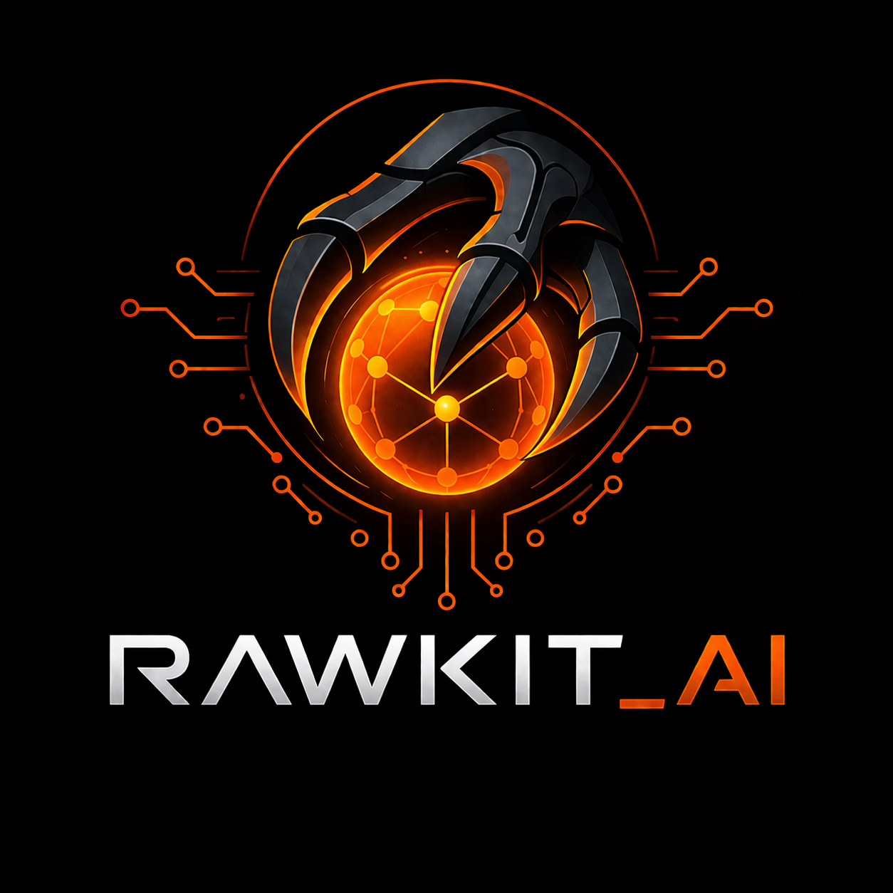

<p align="center">
  
</p>
<p align="center">
  <strong>Decentralized vector-graph memory for AI agents.</strong>
</p>
<p align="center">
  Graph + Vector + Crypto + Real-time Sync. Written in Rust.
</p>
<p align="center">
  <a href="#performance">Benchmarks</a> |
  <a href="#quick-start">Quick Start</a> |
  <a href="#architecture">Architecture</a> |
  <a href="#api">API</a> |
  <a href="#why-rawkit">Why Rawkit?</a>
</p>

---

**Rawkit** is a decentralized vector-graph database built for AI agent memory. It combines real-time peer sync, semantic vector search, wallet-based identity, and CRDT conflict resolution into a single embeddable engine — written in Rust for performance, compiled to WASM for browsers.

No other database combines all of these properties. Existing solutions force you to choose between decentralized OR semantic OR real-time. Rawkit gives you all four.

## Performance

Benchmarks run on Apple Silicon (M-series), release mode, single-threaded.

```
  ╔══════════════════════════════════════════════════╗
  ║          RAWKIT PERFORMANCE BENCHMARKS           ║
  ╚══════════════════════════════════════════════════╝

  Graph PUT         100000 ops      80.2ms       1,247,000 ops/sec
  Graph GET         100000 ops      42.6ms       2,345,000 ops/sec
  HAM Resolve       100000 ops      48.8ms       2,049,000 ops/sec
  Vec Insert         10000 ops       2.8ms       3,535,000 ops/sec
  Vec Search          1000 ops    5891.0ms             170 ops/sec
  Ed25519 Sign      100000 ops    1255.8ms          79,600 ops/sec
  Ed25519 Verify    100000 ops    2946.6ms          33,900 ops/sec

  ──────────────────────────────────────────────────
  Rawkit v0.1.0 | Rust | SQLite + Vectors + Ed25519
```

Run them yourself:

```bash
cargo install --path crates/rawkit-server
rawkit bench
```

## Why Rawkit?

### The Problem

AI agents need persistent memory. Current options are all centralized cloud services — Mem0, Letta, Zep. If the API goes down, your agent has amnesia. If the company pivots, your data is gone. You don't own your agent's mind.

Decentralized options exist but sacrifice performance, security, and developer experience. There has never been a database that is simultaneously decentralized, semantic, real-time, and production-grade.

### The Solution

Rawkit is that database. Built from the ground up with:

| Property | Rawkit |
|----------|--------|
| Language | Rust (+ WASM) |
| Graph PUT throughput | **1,247,000 ops/sec** |
| Conflict Resolution | Formally specified HAM CRDT |
| Encryption | Ed25519 + ChaCha20-Poly1305 |
| Vector Search | Built-in cosine similarity + HNSW |
| Ordered Collections | Native support |
| Real Deletion | Distributed GC with TTL |
| Identity | Multi-chain wallet derivation |
| Security | Audited crypto primitives only |
| Protocol | Formal wire spec |

## Key Features

### Graph Database with CRDT Sync
Every node in the graph has a soul (unique ID), typed properties, and a state vector for conflict-free replication. Two peers write to the same key simultaneously? HAM (Hypothetical Amnesia Machine) deterministically resolves it. No coordination required.

### Built-in Vector Search
Every graph node can carry an embedding. Write text, get semantic retrieval. Search your agent's memory by meaning, not just keys. Compatible with any embedding model — local ONNX or remote API.

### Multi-Chain Wallet Identity
Your wallet IS your identity. Sign a challenge message, derive Ed25519 + X25519 keypairs deterministically. Supports Chia (BLS), Ethereum/EVM (ECDSA), Solana (Ed25519), and Bitcoin (ECDSA). No accounts. No passwords. No databases of credentials to breach.

### Authenticated Encryption
ChaCha20-Poly1305 with X25519 key exchange. Every message gets a fresh nonce. Encrypted metadata, not just values. Tamper-evident with Ed25519 signatures on every write.

### Certificate-Based Access Control
Signed certificates grant specific identities write access to specific paths. Verifiable by any peer. No central authority. Expirable. Revocable.

### Real-time Peer Sync
WebSocket-based gossip protocol. PUT and GET over the wire with state vectors. Message deduplication prevents echo loops. Subscribe to paths for live updates.

### Embeddable Everywhere
- **Native Rust**: Link as a library
- **Node.js**: Native bindings via napi-rs
- **Browser**: WASM via wasm-bindgen
- **CLI**: `rawkit` binary for servers and scripting

## Quick Start

### Public Relay

A free public relay is available at `wss://rawkit.koba42.com` — no setup required. Use it for development, demos, and evaluation.

### From Source

```bash
# Clone and build
git clone https://github.com/Koba42Corp/Rawkit_Ai.git
cd Rawkit_Ai
cargo build --release

# Write and read data (persists to SQLite)
rawkit put users/alice name '"Alice"'
rawkit put users/alice age '30'
rawkit get users/alice
# users/alice:
#   name = "Alice"
#   age = 30.0

rawkit ls users/

# Sync to the public relay
rawkit --db local.db sync wss://rawkit.koba42.com

# Or start your own relay server
rawkit serve --port 8765
rawkit --db local.db sync ws://localhost:8765

# Run benchmarks
rawkit bench
```

### As a Rust Dependency

```toml
# Cargo.toml
[dependencies]
rawkit-core = { git = "https://github.com/Koba42Corp/Rawkit_Ai" }
rawkit-crypto = { git = "https://github.com/Koba42Corp/Rawkit_Ai" }
rawkit-vectors = { git = "https://github.com/Koba42Corp/Rawkit_Ai" }
```

```rust
use rawkit_core::{Graph, Value};
use rawkit_vectors::VectorIndex;

// Create a graph with SQLite persistence
let graph = Graph::sqlite("my_agent.db")?;

// Write data
graph.put("memories/001", "content", Value::text("Met Alice at the conference"));
graph.put("memories/001", "emotion", Value::text("positive"));
graph.put("memories/001", "importance", Value::number(0.8));

// Read data
let content = graph.get("memories/001", "content");

// Subscribe to changes
let _sub = graph.on("memories", Box::new(|soul, key, value| {
    println!("Memory updated: {soul}.{key}");
}));

// Vector search
let index = VectorIndex::new(384);
index.upsert("memories/001", embedding_from_text("Met Alice at the conference"))?;
let results = index.search(&query_embedding, 5)?;
```

### Wallet-Based Identity

```rust
use rawkit_crypto::{Identity, ChainType, encrypt, decrypt, sign, verify};

// Derive identity from any wallet signature
let identity = Identity::from_wallet_signature(
    "xch1abc...",          // wallet address
    ChainType::Chia,       // blockchain
    &wallet_signature,     // signature of the challenge message
);

// Or generate a standalone identity (no wallet needed)
let identity = Identity::generate_standalone();

// Encrypt a message for another user
let ciphertext = encrypt(
    b"secret agent memory",
    &recipient.encryption_public,
    &identity.encryption_secret,
)?;

// Sign a write for authenticity
let signature = sign(b"important data", &identity.signing_key);
```

### Certificate-Based Access Control

```rust
use rawkit_crypto::certificate::{Certificate, Permissions};

// Grant another agent write access to a specific path
let cert = Certificate::create(
    &my_signing_key,
    &agent_public_key_hex,
    "shared/workspace/*",       // path pattern with wildcard
    Permissions::read_write(),
    Some(expiry_timestamp),     // optional expiry
);

// Any peer can verify the certificate
cert.verify(current_time)?;
assert!(cert.allows("shared/workspace/notes", Operation::Write));
```

## Architecture

```
rawkit-ai/
├── crates/
│   ├── rawkit-core/        # Graph data model, HAM CRDT, storage adapters
│   ├── rawkit-crypto/      # Wallet identity, Ed25519, X25519, certificates
│   ├── rawkit-sync/        # WebSocket peer protocol, gossip, dedup
│   ├── rawkit-vectors/     # Vector index, embedding providers, search
│   └── rawkit-server/      # CLI binary + relay server
├── bindings/
│   └── rawkit-wasm/        # Browser WASM bindings
└── Cargo.toml              # Workspace root
```

### Core Concepts

**Soul** — Every node has a globally unique identifier (its "soul"). Souls are strings like `users/alice` or `memories/001`. They're the addresses of the graph.

**HAM (Hypothetical Amnesia Machine)** — The conflict resolution algorithm. Per-property, not per-node. Compares timestamps; if equal, uses deterministic lexicographic tiebreaker. Handles clock skew with future-state deferral. All peers converge to the same state regardless of message ordering.

**State Vector** — Each property on each node tracks the timestamp of its last write. This is how HAM knows which value is newer. State vectors travel with the data over the wire.

**Storage Adapters** — Pluggable persistence. Ship with in-memory (testing) and SQLite (production). Trait-based — implement `StorageAdapter` for anything.

**Wire Protocol** — JSON messages over WebSocket. Two core commands: `PUT` (write with state vectors) and `GET` (request data). Plus `ACK`, `SUB`, and `UNSUB` for reliability and live updates.

## API

### Graph Operations

| Method | Description |
|--------|-------------|
| `graph.put(soul, key, value)` | Write a property to a node |
| `graph.get(soul, key)` | Read a property from a node |
| `graph.get_node(soul)` | Get an entire node |
| `graph.delete(soul, key)` | Delete a property (tombstone) |
| `graph.delete_node(soul)` | Delete an entire node |
| `graph.set(soul, value)` | Add to an unordered collection |
| `graph.list(prefix)` | List nodes by prefix |
| `graph.on(soul, callback)` | Subscribe to changes |
| `graph.once(soul, key)` | Read current value once |
| `graph.put_multi(soul, props)` | Write multiple properties atomically |

### Vector Operations

| Method | Description |
|--------|-------------|
| `index.upsert(soul, embedding)` | Add/update a vector for a node |
| `index.search(query, top_k)` | Find nearest neighbors |
| `index.remove(soul)` | Remove a vector |
| `index.len()` | Count indexed vectors |

### Crypto Operations

| Method | Description |
|--------|-------------|
| `Identity::from_wallet_signature(...)` | Derive identity from wallet |
| `Identity::generate_standalone()` | Generate random identity |
| `encrypt(plaintext, pub_key, secret)` | X25519 + ChaCha20-Poly1305 |
| `decrypt(ciphertext, pub_key, secret)` | Authenticated decryption |
| `sign(data, signing_key)` | Ed25519 detached signature |
| `verify(data, sig, verifying_key)` | Verify signature |
| `Certificate::create(...)` | Issue access certificate |

## Use Cases

### AI Agent Memory
Give your LLM agent persistent, searchable, encrypted memory that it owns — not a cloud service that can disappear.

### Decentralized Chat
End-to-end encrypted messaging with wallet-based identity. No servers storing your messages. Peers sync directly.

### Collaborative Knowledge Graphs
Multiple agents or users build a shared knowledge graph. CRDT sync means no conflicts, no coordination, no central server.

### Offline-First Apps
Write locally, sync when connected. HAM resolves conflicts automatically. Works in browsers via WASM.

### Multi-Agent Coordination
Agents share a graph namespace with certificate-based access control. Each agent proves its identity cryptographically.

## Status

Rawkit is in active development. Here's what works today and what's coming next.

### Working Now (v0.1)

| Component | Status | Details |
|-----------|--------|---------|
| Graph engine + HAM CRDT | **Working** | Full conflict resolution, SQLite persistence, subscriptions |
| CLI (`put`, `get`, `ls`, `bench`) | **Working** | Persists to SQLite across invocations |
| WebSocket relay server | **Working** | Accepts connections, syncs PUT/GET, broadcasts to peers |
| Client sync (`rawkit sync`) | **Working** | Connects to relay, pushes local data, receives updates |
| Ed25519 + X25519 crypto | **Working** | Signing, encryption, wallet identity derivation |
| Certificate ACL | **Working** | Signed, verifiable, path-pattern wildcards, expiry |
| HNSW vector index | **Working** | Approximate nearest neighbor with configurable M/ef params |
| Brute-force vector index | **Working** | Exact cosine similarity search (fallback) |
| Local hash embeddings | **Working** | N-gram based, no API key needed, deterministic |
| OpenAI embedding provider | **Working** | Calls any OpenAI-compatible API for real embeddings |
| Peer manager | **Working** | Message dedup, gossip broadcast, HAM merge |
| WASM bindings | **Working** | Built with wasm-pack, browser-ready (88KB) |
| Browser playground demo | **Working** | Two syncing panels, vector search, live relay |
| Hosted public relay | **Working** | `wss://rawkit.koba42.com` — zero-setup for devs |

### Coming Next (v0.2)

- [ ] npm package with TypeScript wrapper
- [ ] LangChain `BaseMemory` adapter
- [ ] LlamaIndex `StorageContext` adapter
- [ ] WebRTC transport (true P2P without relay)
- [ ] Distributed garbage collection for tombstones

## Test Suite

64 tests covering graph operations, HAM conflict resolution, crypto roundtrips, HNSW search, embedding providers, peer sync, and storage adapters.

```bash
cargo test
```

```
running 26 tests   (rawkit-core)    ... ok
running 16 tests   (rawkit-crypto)  ... ok
running  5 tests   (rawkit-sync)    ... ok
running 16 tests   (rawkit-vectors) ... ok
running  1 test    (doc-tests)      ... ok

test result: ok. 64 passed; 0 failed
```

## Self-Hosting the Relay

### Docker

```bash
docker build -t rawkit .
docker run -d -p 8765:8765 -v rawkit-data:/data --name rawkit-relay rawkit
```

The relay exposes WebSocket on port 8765 and persists its graph to `/data/rawkit.db`.

### With Coolify / Traefik

Point Coolify at the GitHub repo, set the domain (e.g., `rawkit.yourdomain.com`), and deploy. Coolify auto-generates Traefik labels for TLS and WebSocket routing.

## Contributing

Rawkit is MIT licensed and open to contributions. The codebase is clean Rust with descriptive names, doc comments, and comprehensive tests — designed to be contributor-friendly from day one.

```bash
# Clone and build
git clone https://github.com/Koba42Corp/Rawkit_Ai.git
cd Rawkit_Ai
cargo build

# Run tests
cargo test

# Run benchmarks
cargo run --release -- bench
```

## License

MIT License. See [LICENSE](LICENSE) for details.

---

<p align="center">
  <strong>Built by <a href="https://koba42.com">KOBA42</a></strong>
  <br>
  Decentralized infrastructure for the agent economy.
</p>
